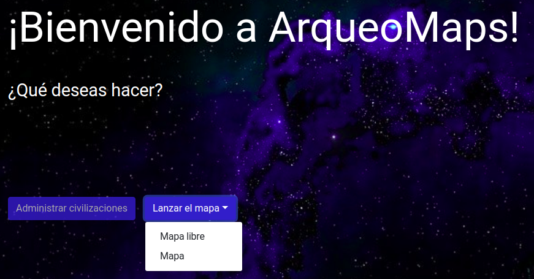
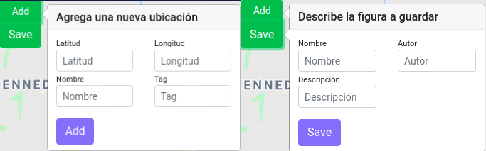

# Arqueomaps

## Manual de uso

---

Arqueomaps es una plataforma web que busca facilitar la visualización y configuración de localizaciones con valor arqueoastronómico. Entre las funciones que provee la plataforma se encuentran la medida de distancias basadas en geodesia entre puntos en un mapa, unión de puntos entre sí y proyecciones basados en ángulos y distancias desde cierto punto, entre otras.

Arqueomaps se divide en dos módulos: [administración](#módulo-de-administración) y [mapas](#módulo-de-mapas). Cada uno de ellos posee diferentes características. En resumen, el módulo de administración se encarga de crear, ver y editar civilizaciones, puntos y figuras dentro de la aplicación y la sección de mapas en el que se concentra las operaciones que se pueden realizar sobre los puntos creados en el módulo de administración.

### Entidades

---

En la aplicación de Arqueomaps se pueden identificar las siguientes entidades:

- Civilizaciones
- Figuras
- Lugares

Las _civilizaciones_ se entienden como una agrupación de diferentes _lugares_ relacionados entre sí, especialmente por su trascendencia para una cultura indígena precolombina. Su nombre y descripción no pueden ser modificados, sin embargo sus lugares sí.

Las _figuras_ son una serie de _lugares_ conectados entre sí. Son la representación de una configuración realizada por un usuario y son observables en un mapa.

Los _lugares_ representan un punto en el mapa con latitud y longitud, además de un nombre, descripción y una etiqueta.

Sobre estas entidades se desarrolla la mayoría de las operaciones o administración en toda la aplicación.

### Módulo de Administración

---

El módulo de administración puede ser accedido desde la página principal, presionando el botón de "administración".

|  |
| :---------------------------------------: |
|   _Vista del módulo de administración_    |

Una vez dentro del módulo de administración, se puede decidir entre las opciones de crear, ver y editar.

_Crear_: Permite crear civilizaciones. Los campos obligatorios para las civilizaciones son tanto el nombre como la descripción. Opcionalmente se pueden agregar lugares. Cualquier modificación a los lugares asociados a una civilización se debe hacer desde la opción de "Editar" en el menú de administración.

_Editar_: Permite editar los lugares de cierta civilización.

_Ver_: Permite ver las _figuras_ creadas por cualquier usuario, sin embargo estas no pueden ser modificadas.

### Módulo de Mapas

---

En la sección de mapas, al que se puede acceder desde la vista principal, se desarrollan las operaciones sobre los _lugares_ anteriormente creados o lugares especificados dentro del mapa y se crean _figuras_. La aplicación permite el uso de dos mapas con funcionalidades similares:

- Mapa libre
- Mapa

|  |
| :-----------------------------------: |
|      _Vista del módulo de mapas_      |

En ambos mapas se pueden operar _lugares_ y crear _figuras_, la diferencia radica en que **el mapa libre no carga los lugares definidos en el módulo de administración**, sino que por el contrario, se deben ingresar manualmente; cosa contraria a lo que sucede al ingresar a "Mapa", donde sí aparecerán listas desplegables para escoger la _civilización_ o filtrar por etiquetas. A continuación se describen específicamente cada uno de los mapas:

_Mapa libre_: Mapa diseñado para crear los lugares directamente desde el mapa, sin la necesidad de pasar por el módulo de administración. Para agregar un _lugar_ al mapa o guardar una configuración de _lugares_ (_figura_), se hace uso del menu en la parte superior izquierda.

|  |
| :---------------------------------------: |
|    _Agrear lugares o guardar figuras_     |

_Mapa_: Este mapa está diseñado para usar los _lugares_ de ciertas _civilizaciones_, por lo tanto cargará los datos que se hayan agregado en el módulo de administración. Para mostrar los _lugares_ de cierta _civilización_, bajo cierta etiqueta o guardar una _figura_, se hace uso del menú en la parte superior izquierda, de manera similar al _Mapa libre_.

### Operaciones entre los lugares

---

Las operaciones actualmente soportadas en la plataforma, para operar entre los lugares son:

- **Stack**: Genera una línea entre los _lugares_ según orden de creación (solo aplica para lugares en el _mapa_, no _mapa libre_).
- **Manualmente**: Al seleccionar el botón de activar, el puntero cambia al estado de unión. Se pueden unir _lugares_ a conveniencia del usuario. El botón de reset permite reiniciar el stack de luagres y elmina la unión entre los mismos.
- **Muchos a uno**: Al seleccionar el botón de activar, el puntero cambia al estado de unión. Se unen todos los _lugares_ en el mapa al _lugar_ seleccionado por el usuario. El botón de reset permite reiniciar el stack de luagres y elmina la unión entre los mismos.
- **Angles**: Al seleccionar el botón de activar, el puntero cambia al estado de selección. Se pueden seleccionar tres _lugares_ donde el primer _lugar_ es el punto base y los otros dos corresponden a las esquinas sobre las cuales se halla el ángulo interior. La información del ángulo obtenido se puede observar en el botón de **Info**, en la misma barra de operaciones.
- **Proyección**: Al seleccionar el botón de activar, el puntero cambia al estado de selección. Una vez seleccionado el _lugar_ deseado para realizar la proyección, se deben agregar distancia, ángulo y nombre para el punto proyectado desde el _lugar_ seleccionado. La distancia y el ángulo toman en cuenta geodesia.
- **Info**: Al seleccionar este botón, se podrán observar los datos de distancia y relaciones entre los _lugares_ existentes, además de información sobre la operación de **Angle**.

|  |
| :----------------------------------------------: |
|              _Barra de operaciones_              |

### Otras anotaciones

---

La versión en release corresponde a una versión alfa, por lo que no se descartan bugs y otros comportamientos no contemplados en la aplicación. Algunas de las funcionalidades no se encuentran disponibles por el momento.
